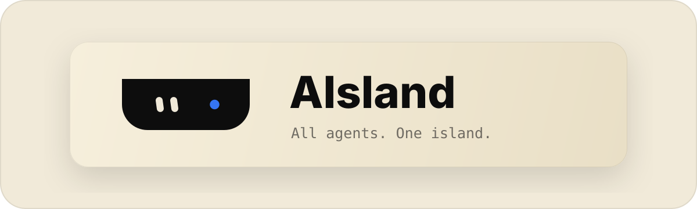
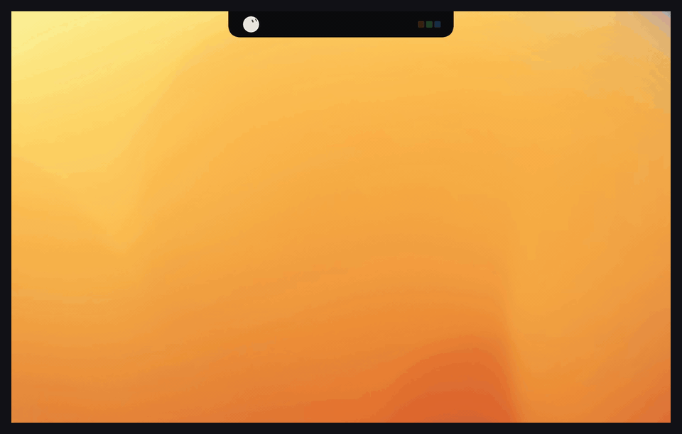
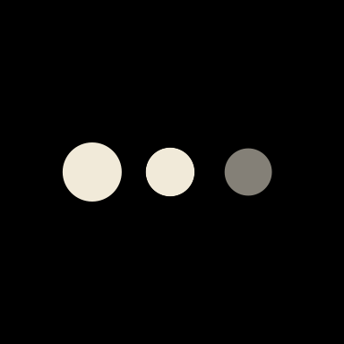
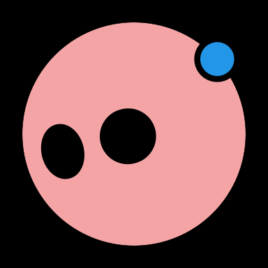
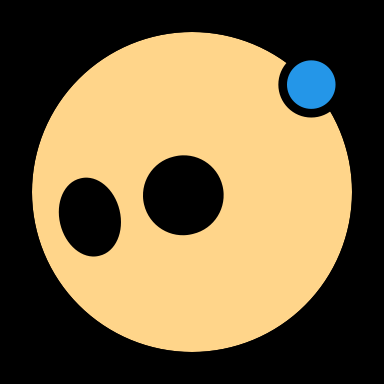
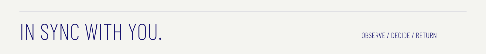
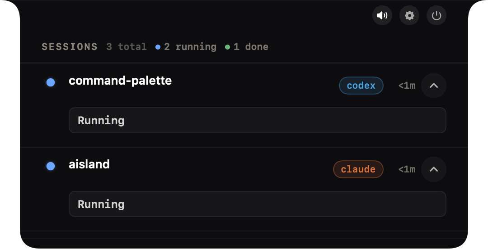
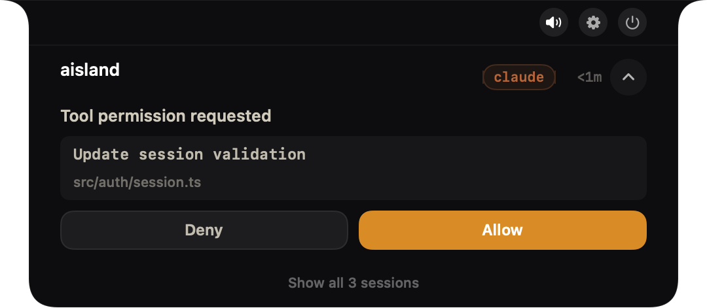
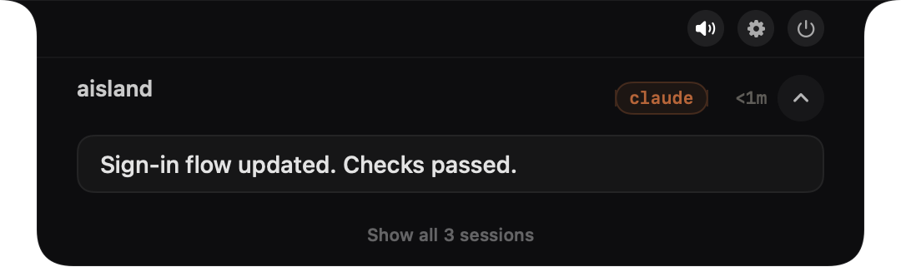

<p align="center">
  <a href="https://aisland.brianliew.chatgpt.site/"></a>
</p>

<p align="center"><strong>English</strong> · <a href="README.zh-CN.md">简体中文</a></p>

<p align="center">
  <strong>AIsland brings your coding agents into your Mac’s notch.</strong><br>See their state. Handle the moment. Get back to your work.
</p>

<p align="center">
  <a href="https://github.com/SeanLiew523/aisland/releases/latest/download/AIsland.dmg"><strong>Download for macOS ↗</strong></a> &nbsp; · &nbsp; <a href="https://aisland.brianliew.chatgpt.site/"><strong>Explore the website ↗</strong></a> &nbsp; · &nbsp; <a href="#quick-start">Quick start</a>
</p>

<p align="center">
  <a href="https://github.com/SeanLiew523/aisland/releases/latest"></a>
  
  <a href="LICENSE"></a>
</p>

<p align="center">
  <a href="https://aisland.brianliew.chatgpt.site/"></a>
</p>

<p align="center"><sub>20-second English native capture · Example sessions · Original macOS wallpaper composite<br><a href="docs/images/readme/native-demo-en.mp4">Full-resolution English video</a> · <a href="https://aisland.brianliew.chatgpt.site/">Explore the website and brand motion</a></sub></p>

## A little expression. A clear next step.

A quiet pulse while thinking. A soft blink while waiting. These are the app’s native status animations.

<table>
  <tr>
    <td align="center" width="210">
      <br>
      <strong>Idle</strong><br><sub>A gentle gaze</sub>
    </td>
    <td align="center" width="210">
      <br>
      <strong>Thinking</strong><br><sub>Three-dot pulse</sub>
    </td>
    <td align="center" width="210">
      <br>
      <strong>Permission</strong><br><sub>A pink alert</sub>
    </td>
    <td align="center" width="210">
      <br>
      <strong>Answer</strong><br><sub>A warm yellow alert</sub>
    </td>
  </tr>
</table>

<p align="center"></p>

- **01 / Observe — Every agent, at a glance.** Bring running, waiting and completed sessions together. See who needs you.
- **02 / Decide — Decide when it matters.** Review supported permission requests. Approve, deny or answer an agent’s question.
- **03 / Return — Back to where you left off.** Jump back to the owning terminal, IDE or desktop app. Available actions depend on the integration.

<details>
<summary>See the native English interface</summary>

### Session overview



### Permission request



### Completion



</details>

**Native. Local. Open.** Built with SwiftUI + AppKit for notched MacBooks, non-notch Macs and external displays. No AIsland account, server or telemetry. English and Simplified Chinese UI.

Works with Claude Code, Codex CLI and Desktop, ZCode, WorkBuddy, Cursor, Gemini CLI, OpenCode and more. Events and interactive actions vary by integration; see [Product Scope](docs/product.md) and [Hook Contracts](docs/hooks.md). Managed agents keep running if AIsland is unavailable.

## Quick Start

### Download

Download the latest DMG from [GitHub Releases](https://github.com/SeanLiew523/aisland/releases), open it, and drag **AIsland** into **Applications**.

The initial releases are development builds and are not Apple-notarized. If macOS blocks the app, open **System Settings → Privacy & Security → Open Anyway** for AIsland. For a quarantined local build, you can also run:

```bash
xattr -dr com.apple.quarantine "/Applications/AIsland.app"
```

Requirements: macOS 14+; release automation builds a Universal app for Apple Silicon and Intel.

### Build from source

```bash
git clone https://github.com/SeanLiew523/aisland.git
cd aisland
swift build
swift run OpenIslandApp
```

To build the AIsland app, ZIP, and DMG locally:

```bash
OPEN_ISLAND_VERSION=0.1.0 zsh scripts/package-aisland.sh
```

Run the deterministic smoke harness with `zsh scripts/harness.sh smoke`.

The executable target names retain the `OpenIsland` prefix for compatibility with existing hooks and local data paths. The shipped app name is **AIsland**.

On first launch, use **Settings → Setup** to select the agents you want to connect. Hook installation happens only when requested there.

AIsland uses the compatible OpenIsland local bridge. Quit Agent Island or Alsland before launching AIsland. Their app files and preferences are not migrated automatically.

## Explore further

[Documentation](docs/index.md) · [Product Scope](docs/product.md) · [Hooks](docs/hooks.md) · [Architecture](docs/architecture.md) · [Packaging](docs/packaging.md)

<details>
<summary><strong>Agent, terminal and desktop integration details</strong></summary>

## Supported Agents

| Agent | Current integration |
|---|---|
| **Claude Code** | Hooks, transcript discovery, permission/question flows, status-line usage bridge |
| **Codex CLI & Desktop** | Low-noise managed hooks, local usage tracking, app-server lifecycle, exact desktop deep-link jump |
| **OpenCode** | Bundled plugin, lifecycle, permission and question events |
| **Qoder** | Claude-format hooks in `~/.qoder/settings.json` |
| **Qwen Code** | Claude-format hooks in `~/.qwen/settings.json` |
| **Factory** | Claude-format hooks in `~/.factory/settings.json` |
| **CodeBuddy** | Claude-format hooks in `~/.codebuddy/settings.json` |
| **ZCode** | Seven-event hook set, interactive permission decisions, desktop liveness, exact conversation focus through the local task index and macOS Accessibility |
| **WorkBuddy** | Nine-event hook set, desktop liveness, and exact `workbuddy://chat/<session-id>` jump-back |
| **Cursor** | Hook integration, session tracking, workspace jump-back |
| **Gemini CLI** | Lifecycle hooks and fire-and-forget session updates |
| **Kimi CLI** | TOML hook installer, lifecycle and permission flow |
| **Grok Build** | Managed hook file, lifecycle tracking and terminal jump-back |
| **Pi** | Bundled TypeScript extension, lifecycle and terminal metadata |
| **Oh My Pi** | Bundled extension with equivalent lifecycle coverage |

The detailed event contracts and compatibility boundaries live in [docs/hooks.md](docs/hooks.md).

## Supported Terminals and IDEs

Full jump-back is available for Terminal.app, Ghostty, iTerm2, WezTerm, Warp, cmux, Kaku, tmux, and Zellij. Workspace-level activation is supported for VS Code, Cursor, Windsurf, Trae, Zed, and JetBrains IDEs.

## ZCode and WorkBuddy

These integrations are maintained as first-class AIsland features:

- **ZCode** stores hooks under `~/.zcode/cli/config.json`. AIsland carries the stable session ID, resolves it read-only through `~/.zcode/v2/tasks-index.sqlite`, selects the matching sidebar conversation through Accessibility, and verifies the resulting heading. If exact focus is unavailable, it falls back to the workspace window or app activation.
- **WorkBuddy** uses Claude-compatible hooks under `~/.workbuddy/settings.json`. AIsland follows the desktop app's liveness and uses WorkBuddy's own `workbuddy://chat/<session-id>` route to open the matching task conversation.

</details>

<details>
<summary><strong>Local bridge, architecture and build targets</strong></summary>

## How It Works

```text
coding agent
    ↓ hook event
OpenIslandHooks CLI
    ↓ local Unix socket
BridgeServer → session state → AIsland UI
    ↓ click
terminal / IDE / exact desktop conversation
```

The repository is a Swift package with four main targets:

| Target | Role |
|---|---|
| `OpenIslandApp` | SwiftUI/AppKit app, menu bar, overlay, settings, jump-back |
| `OpenIslandCore` | Models, bridge protocol, installers, discovery, persistence |
| `OpenIslandHooks` | Lightweight hook process that forwards events locally |
| `OpenIslandSetup` | CLI for installing and removing managed integrations |

See [Architecture](docs/architecture.md), [Hooks](docs/hooks.md), and [Packaging](docs/packaging.md) for implementation details.

</details>

<details>
<summary><strong>Project direction</strong></summary>

## Project Direction

AIsland intentionally develops outside the upstream fork network. The current priorities are:

- reliable ZCode and WorkBuddy behavior on real desktop sessions;
- low-noise, reviewable hook management;
- precise jump-back instead of app activation alone;
- native macOS interaction and stable local permissions;
- user-directed features without a cloud dependency.

</details>

## Contributing

Issues and pull requests are welcome. Start with [CONTRIBUTING.md](CONTRIBUTING.md) and keep changes incremental, reviewable, and verified on the runtime they affect.

<details>
<summary><strong>Contributors</strong></summary>

## Contributors

<table>
  <tr>
    <td align="center" width="160">
      <a href="https://github.com/SeanLiew523"></a><br>
      <a href="https://github.com/SeanLiew523"><strong>SeanLiew523</strong></a><br>
      <sub>Project maintainer</sub>
    </td>
    <td align="center" width="160">
      <a href="https://chatgpt.com/"></a><br>
      <a href="https://chatgpt.com/"><strong>ChatGPT / Codex</strong></a><br>
      <sub>AI development assistant</sub>
    </td>
  </tr>
</table>

</details>

## License and Credits

AIsland is distributed under the [GNU General Public License v3.0](LICENSE).

It is derived from [Open Island](https://github.com/Octane0411/open-vibe-island). Original copyright and license notices are retained, and the upstream authors are credited for their work. AIsland's independent adaptations, as of October 2, 2026, include its C1 branding, native status character, and ZCode / WorkBuddy integrations. AIsland is not an official Open Island release. See [Upstream Relationship](docs/upstream.md).

The native status character adapts [bloub](https://github.com/jeremy-prt/bloub) under its [MIT license](docs/licenses/bloub-MIT.txt).

Artwork and recording details: [README visual assets](docs/images/readme/README.md).
